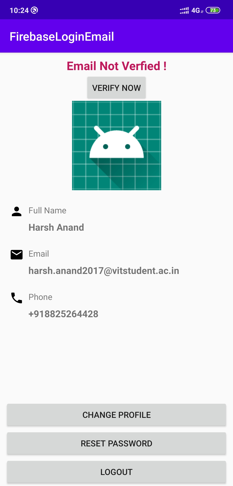
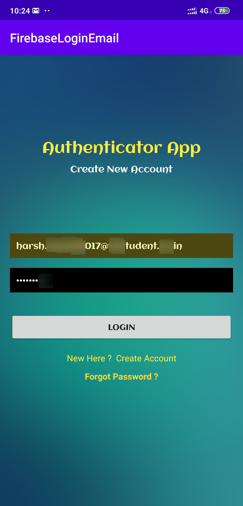

# FirebaseEmailLogin
**Android app implementing:**
-Firebase login via email
-Email Verification
-Profile pic changing features
-Password changing option
-Logout option
 
 

<table>
  <tr>
    <td>Register activity</td>
     <td>Login activity</td>
     <td>Change profile pic and password activity</td>
  </tr>
  <tr>
    <td></td>
    <td></td>
    <td></td>
  </tr>
 </table>
 
