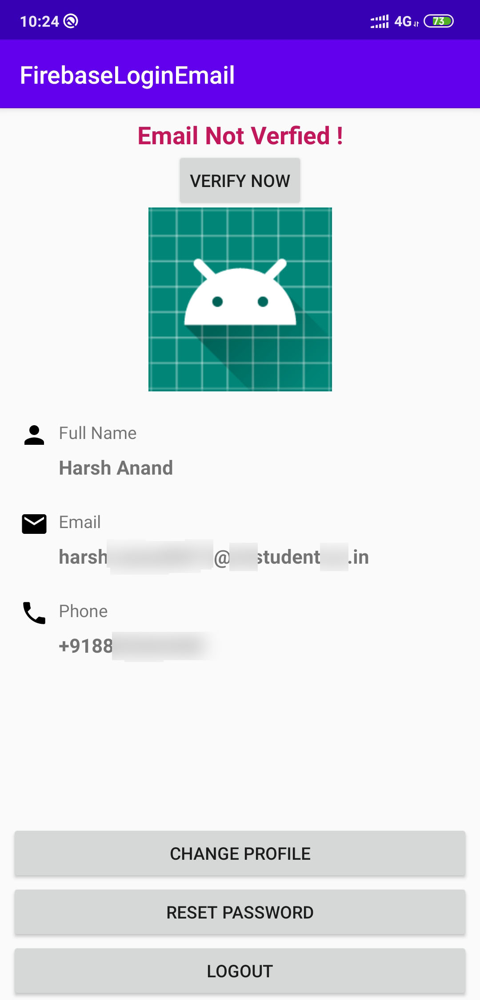

# FirebaseEmailLogin
Android app implementing:
	+ Firebase login via email
	+ Email Verification
	+ Profile pic changing features
	+ Password changing option
	+ Logout option

	
	
Register activity

	
	
Login activity

	
	
Change profile pic and password activity

